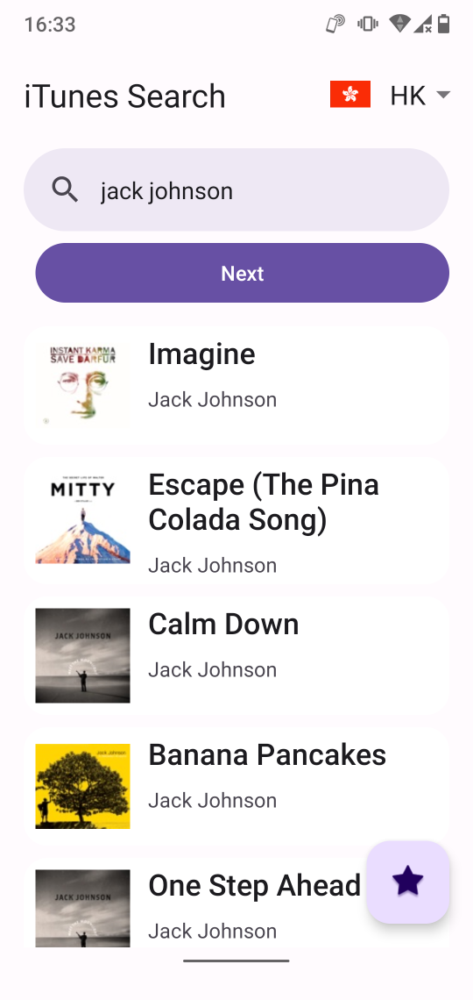
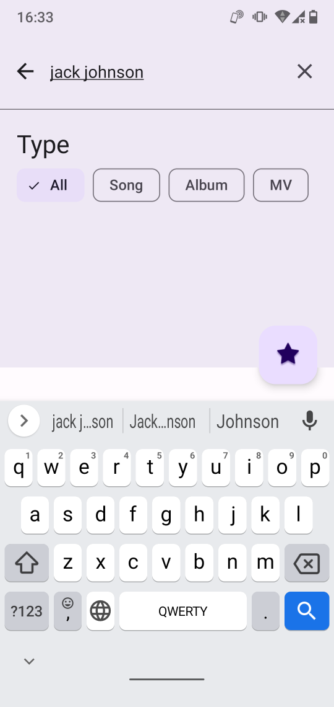
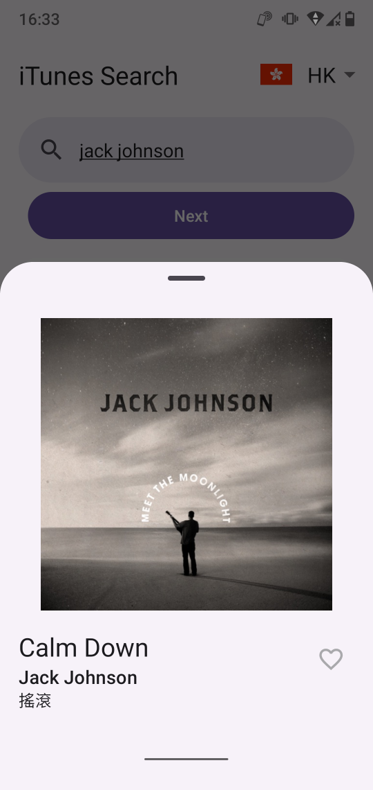
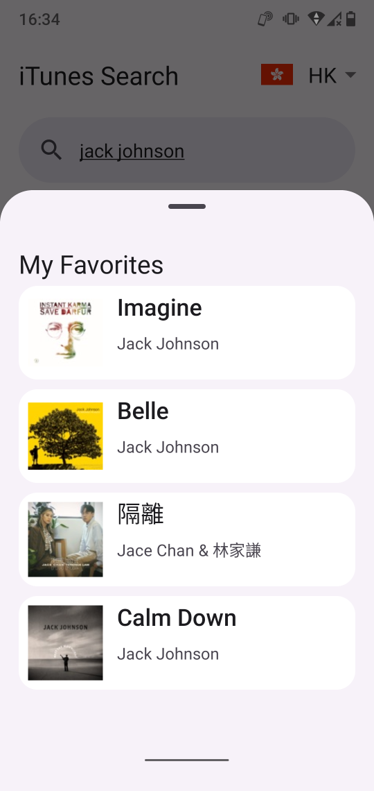
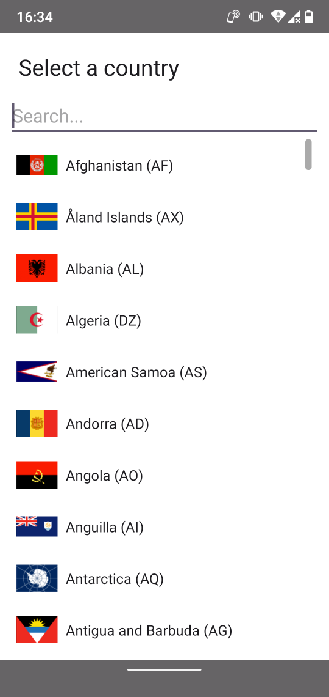

# iTunesSearch

This is an Android application which can search in iTunes Store's music. This application using [iTunes Search API](https://developer.apple.com/library/archive/documentation/AudioVideo/Conceptual/iTuneSearchAPI/index.html) to search the music in iTunes Store and can search for songs, album or artists. It also provided locale selector to filter the search result by locale. This application provide bookmark function to add the music to "favorites" list, and can access on the floating action button on the screen. It have multi language support, currently supported English, Traditional Chinese and Simplified Chinese. 

## Technical details

This application using Kotlin language, and utilized MVVM architecture. It also using ViewBinding and DataBinding for more convenient code handling. There are the libraries using in this application:

- [RetroFit2](https://square.github.io/retrofit/) & [OKHttp3](https://square.github.io/okhttp/)
  - Call the API
- [Coil](https://coil-kt.github.io/coil/)
  - Loading image from URL for album art
- [Country Code Picker](https://github.com/hbb20/CountryCodePickerProject)
  - Locale selector
- [Room](https://developer.android.com/jetpack/androidx/releases/room)
  - Database for favorite list

For the UI/UX, this application using [Material 3](https://m3.material.io/) design system to provide more neat and modern look. It also supported dark mode interface. 

## How to build the application

When imported the project into Android Studio, select the build variants (debug or release) from the side panel click `Build` -> `Build Bundle(s) / APK(s)` -> `Build APK(s)`

## System requirement

Minimum Android version: Android 6.0 

## Notice for making this application

### How to handle paging

In default, iTunes Search API returned maximum 50 items per API search. To reduce the loading time, I limited to 20 items per API call. To load more results, I implemented paging method to handle it. This API have a hidden parameter `offset` for loading more results. For the case of 20 items per API call, which is `limit=20`, when `offset=0`, will load the first 20 results. When `offset=20`, will load the second 20 results, and so on. 

To handle the paging method in the app side, I used LiveData in ViewModel store the current page number, and checking `resultCount` on the response. When `resultCount` is equal to the API call item limit, which is 20 in my app, which mean may have next page of data. if `resultCount` is less then 20, which mean this is the end of the search result. 

## Problems and solutions

First problem I faced is handling search bar with recycler view. If I follow the [documentation](https://github.com/material-components/material-components-android/blob/master/docs/components/Search.md) and using `app:layout_behavior="@string/searchbar_scrolling_view_behavior"` in the NestedScrollView to wrap the RecyclerView, the location of the RecyclerView will be wrong. I determined to use the default layout behavior `app:layout_behavior="@string/appbar_scrolling_view_behavior"` to handle search bar. 

Second problem is the handling for Country Code Picker. I want to execute search again when user changed locale, it is not a straight forward progress, because country code picker is not in the same view model as the search bar. I make a binding adapter to make the picked locale value can be save to the LiveData in ViewModel of search bar, and also save the search request to the ViewModel. When user changed the locale, can execute new search request by modify the existing one. 

Third problem is the method to store the favorite items. Initially I want to use SharedPreferences to store those data, however, this method is fade out in modern days, and it is not very effective to store large size data. I found recently Android Jetpack have a new library called Room, which is better implementation for SQLite. It is simple and reliable, I can integrate with the response data easily, and it supported coroutine natively. Although this is the first time for me to use this library, I can use this library flawlessly. 

## Screenshots

